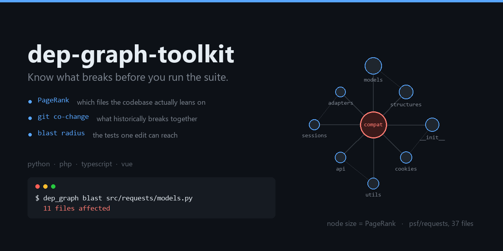

# dep-graph-toolkit



Codebase intelligence for AI coding agents working on repos far too large to fit in a
context window: a SQLite-backed dependency graph with **PageRank importance**, **git
co-change history**, and **blast-radius** computation.

It exists to answer one question well — *given this edit, what else is likely to break?*
— cheaply enough to run on every change.

## Why

An agent editing a large codebase has two bad options: read everything (blows the
context window, and irrelevant context measurably lowers answer quality) or guess
(misses the caller three files away). A dependency graph is the cheap third option.

The interesting signal turned out not to be imports alone. **Import structure tells you
what *can* break; git history tells you what *actually* breaks together.** Files with
high PageRank *and* high co-change are where regressions concentrate — that pairing is
what `hot` surfaces.

## Install

Python 3.9+, standard library only. No dependencies.

```bash
git clone https://github.com/xtm888/dep-graph-toolkit
cd dep-graph-toolkit
python dep_graph.py index /path/to/your/project
```

The graph is stored in `~/.dep-graph/dep_graph.sqlite`. Set `DEP_GRAPH_DB` to keep a
separate graph per project:

```bash
DEP_GRAPH_DB=./mygraph.sqlite python dep_graph.py index .
```

## Example

Indexing [psf/requests](https://github.com/psf/requests) — 37 files, 6,493 commits:

```
$ python dep_graph.py rank --top 8

Rank  PageRank   Symbols  Lang         File
────────────────────────────────────────────────────────────────────────────
1     1.0000     1        python       src/requests/compat.py
2     0.5484     5        python       src/requests/models.py
3     0.3929     2        python       src/requests/structures.py
4     0.3877     2        python       src/requests/__init__.py
5     0.2552     14       python       src/requests/cookies.py
6     0.2547     3        python       src/requests/_internal_utils.py
7     0.2372     3        python       tests/testserver/server.py
8     0.2349     25       python       src/requests/exceptions.py
```

`compat.py` ranks first because nearly every module in the package reaches it — which is
exactly the file you want to be careful with.

```
$ python dep_graph.py blast src/requests/models.py

Blast radius for: src/requests/models.py

  11 files affected:

  Depth   PageRank   File
  ────────────────────────────────────────────────────────────
  1       0.3877       → src/requests/__init__.py
  1       0.2552       → src/requests/cookies.py
  1       0.2349       → src/requests/exceptions.py
  1       0.2023       → src/requests/auth.py
  1       0.1959       → src/requests/utils.py
  1       0.1503       → src/requests/api.py
  1       0.1503       → src/requests/sessions.py
  1       0.1476       → src/requests/adapters.py
```

## Use

```bash
python dep_graph.py rank --top 20        # most important files by PageRank
python dep_graph.py blast path/to/file   # what breaks if this changes
python dep_graph.py rdeps path/to/file   # what depends on this
python dep_graph.py deps  path/to/file   # what this depends on
python dep_graph.py cochange path/to/file  # what changes together (git history)
python dep_graph.py hot --top 20         # high PageRank + high churn
python dep_graph.py query <symbol>       # find a symbol across the codebase
python dep_graph.py symbols path/to/file
python dep_graph.py stats
```

Import parsing covers PHP, Python, JavaScript/TypeScript (incl. JSX/TSX) and Vue.
Other source files are indexed but contribute no dependency edges.

### Test selection

The use this was built for. `rdeps` gives the reverse-dependency set of a changed file;
filter that to test files and you have the tests that edit can plausibly break — a
targeted run instead of the whole suite, fast enough to gate every task.

```bash
python dep_graph.py rdeps src/models/order.py | grep -i test
```

## codeintel.py

An optional router that sits over `dep_graph.py` and a second backend
(`codebase-memory-mcp`), because the two answer genuinely different questions:

| | dep_graph | codebase-memory-mcp |
|---|---|---|
| import-level graph | ✅ | — |
| PageRank importance | ✅ | — |
| git co-change / churn | ✅ | — |
| call-level edges | — | ✅ |
| Cypher queries | — | ✅ |
| semantic / AST search | — | ✅ |

It adds two views neither produces alone:

```bash
python codeintel.py trace <function>   # call tree, each hop tagged with PageRank + churn
python codeintel.py impact <file>      # import blast + co-change ⊕ call-level callers
python codeintel.py doctor             # backend availability and alignment
```

`dep_graph.py` is standalone; `codeintel.py`'s combined views need the second backend
installed, and `doctor` will tell you which are available.

## Notes

- Indexing a mid-size repo takes roughly 25 seconds; re-index after large changes.
- Co-change analysis needs real git history — a shallow clone will produce thin results.
- PageRank runs over the import graph, so a file's score reflects how much of the
  codebase reaches it, not how often it is edited. That is why `hot` combines it with
  churn rather than using either alone.

## License

MIT
